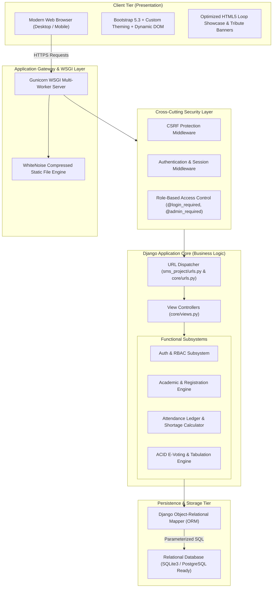
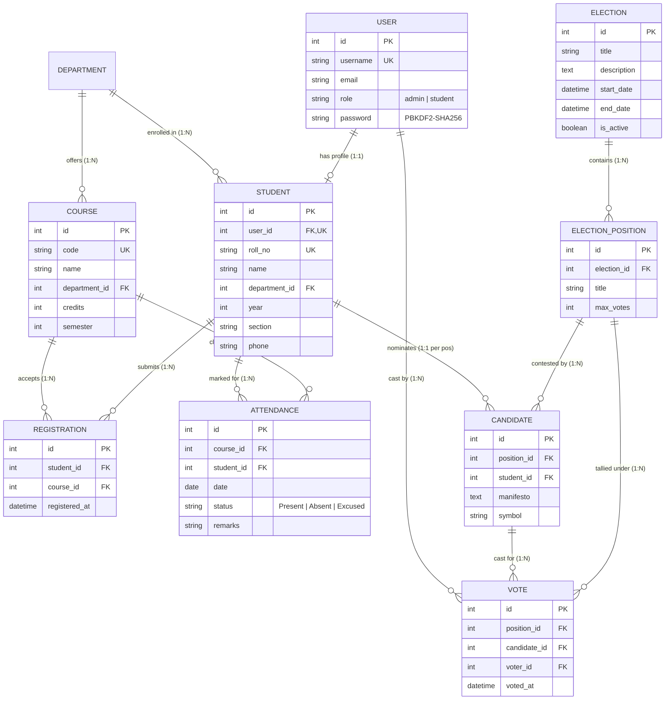

# DR RVR NRI Institution of Technology — Student Management System (SMS)

[](https://www.djangoproject.com/)
[](https://www.python.org/)
[](https://getbootstrap.com/)
[]()
[]()

An enterprise-grade, full-stack academic management and campus governance portal built for **DR RVR NRI Institution of Technology**. The platform unifies student lifecycle administration, course self-registration, biometric/ledger attendance tracking with automated statutory shortage alerts, and a cryptographically sound campus e-voting engine.

---

## 1. Executive Summary & Problem Formulation

Traditional academic institutions face severe operational friction:
1. **Attendance Ledger Fragmentation**: Manual roll-calls cause administrative overhead, proxy attendance, and delayed calculation of semester eligibility (<75% threshold).
2. **Campus Governance Deficits**: Paper-based student council ballots are labor-intensive, lack transparent audit trails, and risk duplicate or invalid voting.
3. **Decentralized Records**: Disconnected course catalogs and student profiles lead to data synchronization delays.

**Solution**: This system implements a cohesive, high-performance web architecture adhering to **MVT (Model-View-Template)** patterns, enforcing strict relational integrity, atomic ballot persistence, role-based access control (RBAC), and 12-factor cloud deployment readiness.

---

## 2. System Architecture

The application adopts a modular multi-tier architecture separating presentation, business logic, data persistence, and cross-cutting security concerns:



---

## 3. Relational Schema & Entity-Relationship (ER) Design

The relational schema implements declarative integrity constraints, surrogate keys, and foreign key cascades to guarantee ACID properties:



### Key Data Integrity Guarantees:
- **Attendance Uniqueness**: `unique_together = ('course', 'student', 'date')` guarantees a student cannot have duplicate attendance logs for the same course on any given calendar day.
- **Single-Choice Ballot Rule**: `unique_together = ('position', 'voter')` enforces at the schema level that a voter can cast at most **one** vote per election position.
- **Registration Deduplication**: `unique_together = ('student', 'course')` prevents redundant course enrollments.

---

## 4. Core Module Technical Breakdown

### 4.1. Role-Based Access Control (RBAC) & Authentication
- **Custom Identity Model**: Inherits from `AbstractUser` with an enumerated `role` field (`admin`, `student`).
- **Authorization Decorators**: Custom `@admin_required` enforces least-privilege principles, rejecting unprivileged access with HTTP 403 Forbidden or redirection to unauthorized warnings.
- **Session Security**: Session tokens are cryptographically secured, flagged `HttpOnly`, and tied to salted user credentials.

### 4.2. Attendance Tracking & Statutory Analytics
- **Batch Processing**: Single-transaction roll-call view allows faculty to record attendance across all enrolled students in one HTTP POST.
- **Quick-Fill Automation**: JavaScript client-side hooks (`markAll('Present')` / `markAll('Absent')`) streamline lecture roll-call.
- **Threshold Algorithm**:
  $$\text{Attendance \%} = \left( \frac{\text{Sessions Present}}{\text{Total Sessions Logged}} \right) \times 100$$
- **Eligibility Alerts**: Dynamic status computation flags students with `< 75%` attendance in real-time, displaying contextual alert banners and progress bar indicators.

### 4.3. Campus E-Voting Engine (ACID Compliant)
- **Atomic Ballot Submissions**: All votes within a ballot are committed using `django.db.transaction.atomic()`. Any integrity failure or partial submission rolls back the entire ballot, preventing partial or corrupted votes.
- **Temporal & State Guards**: Submissions verify both `election.is_active == True` and that current system time falls strictly between `start_date` and `end_date`.
- **Double-Voting Prevention**: View checks existing vote records prior to processing; database uniqueness constraints guarantee race-condition immunity.
- **Real-Time Tabulation**: Aggregates candidate vote counts using Django ORM `Count('votes')` and computes live percentage shares.

### 4.4. Hero Showcase & Academic Dedication Banner
- Seamless loop HTML5 campus video hero with zero runtime bars, muted background playback, and persistent layout sizing.
- Symmetric flanking banners dedicated to **Happy Teachers' Day**, highlighting faculty appreciation and cultural alignment.

---

## 5. Security & Threat Mitigation Architecture

| Threat Vector | Mitigation Strategy Implemented |
| :--- | :--- |
| **SQL Injection (SQLi)** | 100% parameterization via Django ORM; zero raw string SQL concatenation. |
| **Cross-Site Request Forgery (CSRF)** | Synchronizer Token Pattern (``) on all state-altering forms. |
| **Credential Exposure** | Passwords hashed using PBKDF2 with SHA-256 and salt (minimum 600,000 iterations). |
| **Cross-Site Scripting (XSS)** | Auto-escaping enabled by default in Django template engine. |
| **Session Hijacking** | Secure session cookies, automatic expiration, and session key rotation upon login/logout. |
| **Vote Tampering / Race Conditions** | Atomic database transactions (`transaction.atomic`) + schema-level compound unique indexes. |

---

## 6. Directory Structure

```
student_management/
├── manage.py                          # Management CLI entry point
├── requirements.txt                   # Production & dev dependencies
├── Dockerfile                         # Containerization image definition
├── render.yaml                        # Infrastructure-as-Code for Cloud PaaS
├── Procfile                           # Web process definition (Gunicorn)
├── sms_project/                       # Project root configuration
│   ├── settings.py                    # Environment, security, & app settings
│   ├── urls.py                        # Root routing table
│   ├── wsgi.py                        # WSGI production gateway
│   └── asgi.py                        # ASGI asynchronous gateway
├── core/                              # Primary core application
│   ├── models.py                      # Relational data models (ER schema)
│   ├── views.py                       # Business logic & controller endpoints
│   ├── urls.py                        # Application URL mapping
│   ├── admin.py                       # Django Admin customization
│   ├── tests.py                       # Automated verification test suite
│   └── management/commands/
│       └── init_db.py                 # Automated seed data generator
├── static/                            # Static asset repository
│   ├── css/style.css                  # Custom theme stylesheet
│   └── videos/campus_tour.mp4         # Embedded campus tour hero video
└── templates/                         # Modular Django templates
    ├── base.html                      # Root layout, navigation, flash messages
    ├── home.html                      # Dashboard + hero showcase + banners
    ├── students.html                  # Student directory & management
    ├── courses.html                   # Catalog & self-registration
    ├── departments.html               # Departmental hierarchy
    ├── attendance_dashboard.html      # Faculty attendance overview
    ├── mark_attendance.html           # Batch roll-call ledger interface
    ├── course_attendance_report.html  # Comprehensive percentage metrics
    ├── my_attendance.html             # Student attendance dashboard (<75% alert)
    ├── elections_list.html            # Public voting portal
    ├── election_ballot.html           # Single-choice voting interface
    └── election_results.html          # Dynamic vote visualization & winner tally
```

---

## 7. Automated Test Suite & Verification

The application includes automated unit and integration tests under [core/tests.py](file:///c:/Users/RVS10/OneDrive/Desktop/student_management/core/tests.py) covering data integrity, threshold calculations, and atomic voting safeguards.

Execute the test suite:
```bash
python manage.py test core
```

### Test Coverage Summary:
- `test_mark_and_calculate_attendance`: Verifies batch attendance creation and accurate percentage tallying.
- `test_attendance_uniqueness_constraint`: Verifies rejection of duplicate attendance records for the same student/session.
- `test_attendance_shortage_threshold`: Validates that $< 75\%$ attendance correctly triggers shortage warnings.
- `test_cast_vote_and_prevent_double_voting`: Tests atomic ballot submission and verifies rejection of double-voting attempts.
- `test_election_results_tally`: Confirms exact mathematical vote tallying and percentage distribution across candidates.

---

## 8. Deployment & DevOps Architecture

### 8.1. Local Environment Execution
```bash
# 1. Clone repository
git clone https://github.com/Rishikvelagapudi/sms_app.git
cd sms_app

# 2. Install dependencies
pip install -r requirements.txt

# 3. Apply schema migrations
python manage.py migrate

# 4. Seed system with demo data (Admin, Students, Attendance, Elections)
python manage.py init_db

# 5. Run test suite
python manage.py test core

# 6. Launch development server
python manage.py runserver 5000
```
Visit: **http://127.0.0.1:5000** | Admin: **http://127.0.0.1:5000/admin/**

### 8.2. Containerized Execution (Docker)
```bash
# Build the Docker image
docker build -t sms-app:latest .

# Run containerized application on port 5000
docker run -p 5000:5000 --env SECRET_KEY="production-secret" sms-app:latest
```

### 8.3. Production Cloud Hosting (Render / Heroku)
- **Application Server**: Gunicorn multi-worker WSGI (`gunicorn sms_project.wsgi:application --bind 0.0.0.0:$PORT`).
- **Static Assets**: Compressed & cached with HTTP expiration headers via WhiteNoise (`whitenoise.storage.CompressedStaticFilesStorage`).
- **Deployment Blueprint**: Declarative configuration provided via `render.yaml` and `Procfile`.

---

## 9. Jury Presentation Guide & Demonstration Flow

### 9.1. Evaluation Credentials

| Persona | Username | Password | Role | Evaluation Scope |
| :--- | :--- | :--- | :--- | :--- |
| **System Administrator** | `admin` | `admin123` | Admin | Full CRUD, Roll-Call Attendance Marking, Election Configuration, Django Admin |
| **Student (Regular)** | `rahul` | `student123` | Student | Course Self-Registration, View 80% Attendance, Cast Ballot in Council Election |
| **Student (Shortage)** | `priya` | `student123` | Student | Course Registration, Shortage Alert (50% < 75%), Cast Ballot in Council Election |

---

### 9.2. Three-Minute Demo Flow for Academic / Technical Jury

1. **Architecture & Dashboard (0:00 - 0:45)**:
   - Present the homepage dashboard displaying real-time aggregation counters (Students, Courses, Attendance Logs, Active Elections).
   - Highlight the seamless campus hero video showcase and Happy Teachers' Day flanking banners.
   - Explain the 3-tier MVT design and RBAC model.

2. **Faculty Attendance Management & Shortage Analytics (0:45 - 1:45)**:
   - Log in as `admin` $\rightarrow$ Navigate to **Attendance**.
   - Open **Mark Attendance** for a course $\rightarrow$ Demonstrate 1-click **"Mark All Present"** batch capture.
   - Switch to **Student View (`priya`)** $\rightarrow$ Show **"My Attendance"** dashboard highlighting the **Red Alert for Shortage (< 75%)** and requirement for condonation.

3. **Secure Campus E-Voting & ACID Ballot Submission (1:45 - 2:30)**:
   - Log in as `rahul` $\rightarrow$ Navigate to **Campus Elections** $\rightarrow$ Select **Student Council Election 2026**.
   - Cast vote for candidates across positions.
   - Attempt to revote $\rightarrow$ Demonstrate immediate rejection and security alert.
   - Open **Live Results** $\rightarrow$ Show real-time vote percentage bars and winner badges.

4. **Code Quality, Security & Automated Testing (2:30 - 3:00)**:
   - Show terminal running `python manage.py test core` with 5 passing test cases.
   - Highlight database constraints (`unique_together`) and `transaction.atomic()` ensuring zero corrupt state.

---

## 10. Contributors & Institution

- **Institution**: DR RVR NRI Institution of Technology
- **Repository**: [github.com/Rishikvelagapudi/sms_app](https://github.com/Rishikvelagapudi/sms_app)
- **Lead Developer**: Rishik Velagapudi
- **License**: Academic Free Software License (DR RVR NRI IT)
